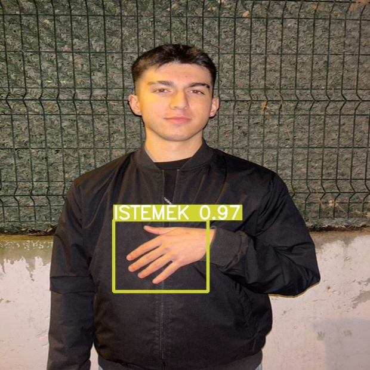

# Türkçe İşaret Dili Tanıma Projesi

>>ÖZET: 
> **Günlük hayatta insanlar; fikirlerini, düşüncelerini ve yaşadıklarını çevrelerindeki insanlara iletmek için birbirleriyle etkileşirler. Aynı dili konuşan insanlar bazı durumlarda dil kullanmadan da birtakım işaretlerle iletişim kurabilmektedirler. İşitme engellilerin iletişim sağlamak amacıyla parmak, el, kol, yüz hareketlerini kullanarak oluşturduğu işaret dili, doğal bir iletişim aracıdır. 
Ne yazık ki ülkemizde işaret dilinin ihmal edilmesi; bu konuda sözlük, dil bilgisi, ders kitabı, yardımcı ders kitapları ve malzemelerinin hazırlanması, araştırmalar yapılması yeterince teşvik görmediği gibi ulusal işaret dilimizin yaygınlaştırılmasını da geciktirdi. Bütün bu olumsuzlukların yanında okulumuzda ve çevremizde yaptığımız araştırmalar sonucunda işaret dili bilgisine dair yüzdemizin düşük olduğunu gördük. Bu kapsamda öncelikle bu konuda farkındalığı arttırmak adına okulumuzda işaret dili kullanımına yönelik bir seminer düzenledik. Ardından yaptığımız gözlemlerde gördük ki öğrencilerimizin bu konuda ilgi alaka ve farkındalıkları seminer öncesine göre, seminer sonrasında artış gösterdi. Bunun üzerine işaret dili bilmeyen bir birey ile işitme engelli bir bireyin iletişimini nasıl kuvvetlendirebiliriz sorusu üzerine bir proje hayal etmeye başladık. Ve düşündük ki nesne tanıma artık günlük hayatın birçok alanına yerleşmiş durumda. Teknolojinin sürekli olarak gelişmesi insanoğlunun yaptığı birçok işin bilgisayarlar tarafından yapılmasını sağlamaktadır.
İşaret dili engelli insanların iletişim kurmasında sözel ifadelerin kullanılması yerine bedensel ifadelerin kullanılması esasına dayanır. Burada önemli olan hangi işaretin ne anlama geldiğini bir değişmezlik çerçevesinde ele almaktır. Bunu da nesne tanıma sistemleri kullanarak başarmak mümkündür. Öncelikli olarak işaret dilinin temel hareketlerinin veritabanının oluşturulması gerekir. Burada dikkat edilmesi gereken nokta veritabanın büyüklüğüdür. Veritabanı ne çok küçük ne de çok büyük olmalıdır. Çünkü veritabanı kısıtlı kaldığında hareketin sınıflandırılması zorlaşacak. Çok büyük olduğunda ise karar verme süresi artacağı gibi çakışmalar meydana gelebilir.**

>> Proje Ekibi:
> - Danışman: Deniz Eroğlu

>> Örnekler: 
İstemek 

>> Kullanılan Teknolojiler:
> - YOLOV5 [link](https://github.com/ultralytics/yolov5)
> - Python [link](https://github.com/ultralytics/yolov5)
> - OpenCV [link](https://github.com/ultralytics/yolov5) 
